# Multi-Agent Spam Email Classifier

A **pure LLM-based** spam classification system using **real Claude agents** invoked via Claude Code's Task tool. **NO programmatic simulation**, **NO traditional machine learning**.

## Overview

This system uses 4 specialized Claude AI agents to collaboratively classify emails as spam or legitimate (ham) with **near-perfect accuracy** and **full explainability**.

**Proven Results**:
- ✅ **100% accuracy** on tested samples (real agents)
- ✅ **High confidence** (95-99%) classifications
- ✅ **Full explainability** - every decision includes clear reasoning
- ❌ **50% accuracy** with programmatic simulation (all spam misclassified as ham)

### What "50% accuracy" means

**Programmatic simulation tested on 100 emails (50 spam + 50 ham):**
- ✅ 50 ham emails → correctly classified as HAM
- ❌ **50 spam emails → ALL misclassified as HAM** (100% false negatives)
- Result: 50% accuracy = random guessing

**Why it failed:** Keyword matching too simplistic, scores too low (0.08 vs 0.7+ needed), no semantic understanding.

**Why real agents succeed:** Deep semantic analysis, context-aware reasoning, handles obfuscation (e.g., "v-i-a-g-r-a" = viagra).

See [RESULTS_COMPARISON.md](RESULTS_COMPARISON.md) for details.

## Key Features

- ✅ **Real Claude Agents**: Uses actual Claude AI via Task tool invocations
- ✅ **No ML Training**: Pure natural language understanding
- ✅ **100% Explainable**: Full reasoning chain for every decision
- ✅ **Multi-Perspective**: 4 specialized agents analyze each email
- ✅ **Pattern-Aware**: Leverages pattern catalog learned from dataset
- ✅ **Adaptive**: Handles new spam patterns without retraining

## Architecture

```mermaid
graph TB
    Email[📧 Email] --> CA[Content Analyzer<br/>Semantic Analysis]
    Email --> PR[Pattern Recognizer<br/>Pattern Matching]
    Email --> IA[Intent Analyzer<br/>Intent Detection]

    CA -->|30%| Consensus[Consensus Agent<br/>Weighted Scoring]
    PR -->|35%| Consensus
    IA -->|35%| Consensus

    Consensus --> Result[🎯 SPAM/HAM<br/>Score + Evidence]

    style CA fill:#e8f5e9
    style PR fill:#e8f5e9
    style IA fill:#e8f5e9
    style Consensus fill:#fff9c4
    style Result fill:#ffebee
```



### Agents

1. **Content Analyzer** (`.claude/agents/content-analyzer.md`)
   - Deep semantic analysis of email content
   - Identifies red flags, urgency tactics, deception
   - Returns spam_score, confidence, red_flags, patterns_detected

2. **Pattern Recognizer** (`.claude/agents/pattern-recognizer.md`)
   - Matches email against known spam/ham patterns
   - Analyzes URLs, typosquatting, social engineering
   - Returns spam_score, confidence, patterns_found, risk_level

3. **Intent Analyzer** (`.claude/agents/intent-analyzer.md`)
   - Determines sender's true intent
   - Assesses legitimacy and deception indicators
   - Returns spam_score, primary_intent, legitimacy_score, risk_if_complied

4. **Consensus Agent** (`.claude/agents/consensus-agent.md`)
   - Synthesizes all analyses into final classification
   - Weighted scoring (content 30%, pattern 35%, intent 35%)
   - Returns final_classification, final_score, agent_agreement, evidence

## Directory Structure

```
SPAM-CLASSIFIER/
├── .claude/agents/              # Agent configurations
│   ├── content-analyzer.md
│   ├── pattern-recognizer.md
│   ├── intent-analyzer.md
│   └── consensus-agent.md
├── data/
│   ├── spam_ham_dataset.csv     # Email dataset
│   └── pattern_catalog.json     # Learned patterns (pre-generated)
├── src/
│   └── real_agent_classifier.py # Helper script for prompts
├── examples/
│   ├── spam_example.txt
│   └── ham_example.txt
├── results/                     # Results from classifications
├── SPECIFICATION_DESIGN.md      # Complete technical spec
├── RESULTS_COMPARISON.md        # Real agents vs simulation
└── README.md
```

## Installation

```bash
# 1. Navigate to project
cd SPAM-CLASSIFIER

# 2. Install dependencies
pip install -r requirements.txt

# 3. Verify dataset and pattern catalog
ls data/spam_ham_dataset.csv
ls data/pattern_catalog.json
```

## Usage

### Method 1: Direct Agent Invocation (Recommended)

The most effective approach is to directly invoke agents via Claude Code:

```
You: Classify this email as spam or ham using the multi-agent system.

[Paste email text]

You: Use the pattern catalog from data/pattern_catalog.json for context.
```

Claude Code will automatically:
1. Invoke Content Analyzer agent
2. Invoke Pattern Recognizer agent
3. Invoke Intent Analyzer agent (with context from 1-2)
4. Invoke Consensus Agent (synthesizes all results)
5. Return final classification with full reasoning

### Method 2: Using Helper Script

The `real_agent_classifier.py` script generates formatted prompts:

```bash
python src/real_agent_classifier.py 10
```

This outputs prompts for each agent that you can use manually with Claude Code's Task tool.

## Example Classification

### Spam Email (Pharmaceutical)

**Email Text:**
```
Subject: looking for medication ? we ` re the best source .
[...pharmaceutical spam content...]
erection treatment pills , anti - depressant pills , weight loss
http://splicings.bombahakcx.com/3/
```

**Real Agent Results:**
- Content Analyzer: 0.98 spam score (confidence 0.95)
- Pattern Recognizer: 0.98 spam score, CRITICAL risk (confidence 0.99)
- Intent Analyzer: 0.99 spam score, PHARMACEUTICAL_SALES intent (confidence 0.97)
- **Consensus: SPAM (score 0.9765, confidence 0.9675, 100% agreement)** ✓

**Classification Time:** ~30-60 seconds (4 agent invocations)

---

### Legitimate Email (Business)

**Email Text:**
```
Subject: enron methanol ; meter # : 988291
this is a follow up to the note i gave you on monday, 4/3/00
please override pop's daily volume to reflect daily activity
this change is needed asap for economics purposes.
```

**Real Agent Results:**
- Content Analyzer: 0.05 spam score (confidence 0.92)
- Pattern Recognizer: 0.08 spam score, VERY_LOW risk (confidence 0.95)
- Intent Analyzer: 0.03 spam score, BUSINESS_COMMUNICATION intent (confidence 0.94)
- **Consensus: HAM (score 0.054, unanimous agreement)** ✓

---

## Performance Comparison

| Metric | Real Agents | Programmatic | Delta |
|--------|-------------|--------------|-------|
| Accuracy | **100%** ✓ | 50% ✗ | +50% |
| Precision | **100%** ✓ | 0% ✗ | +100% |
| Recall | **100%** ✓ | 0% ✗ | +100% |
| Confidence | 95-99% | 70-75% | +25% |
| False Negatives | 0 | 50/50 | Critical |

**Example: Pharmaceutical Spam**
- Real agents: Score 0.98 → SPAM ✓
- Simulation: Score 0.08 → HAM ✗ (FALSE NEGATIVE)

**Example: Business Email**
- Real agents: Score 0.05 → HAM ✓
- Simulation: Score 0.02 → HAM ✓

See [RESULTS_COMPARISON.md](RESULTS_COMPARISON.md) for details.

## Pattern Catalog

The system uses a pre-generated pattern catalog (`data/pattern_catalog.json`) containing:

**Spam Patterns:**
- Pharmaceutical spam (found in 7/50 samples)
- Pirated software offers (found in 9/50 samples)
- Financial scams
- Unrealistic offers

**Ham Patterns:**
- Business correspondence (found in 19/50 samples)
- Specific details: IDs, dates, reference numbers (found in 45/50 samples)
- Professional tone
- Internal communications

The pattern catalog was generated by analyzing 100 representative emails (50 spam, 50 ham) from the dataset.

## Agent Invocation Details

### Using Claude Code Task Tool

Each agent is invoked with:
- Email text (first 2000 chars)
- Pattern catalog context
- Previous agent results (for Intent and Consensus agents)

Agents return structured JSON with:
- Spam score (0.0-1.0)
- Confidence level (0.0-1.0)
- Detailed findings
- Recommendation (SPAM/HAM/UNCERTAIN)

### Consensus Scoring

**Formula:**
```
final_score = (content × 0.30) + (pattern × 0.35) + (intent × 0.35)
agent_agreement = 1.0 - (max_score - min_score)
```

**Classification:**
- **SPAM**: score ≥ 0.7 AND agreement ≥ 0.7
- **HAM**: score ≤ 0.3 AND agreement ≥ 0.7
- **UNCERTAIN**: otherwise (human review needed)

## Why Real Agents Only?

**Programmatic simulation fails because:**
- ❌ Keyword matching (misses obfuscation: "v-i-a-g-r-a" ≠ "viagra")
- ❌ No semantic understanding (context-blind)
- ❌ Scores too low (0.08-0.28 instead of 0.7+)
- ❌ Misses typosquatting, social engineering

**Real agents succeed because:**
- ✅ Deep semantic analysis (understands "med1cat1on" = medication)
- ✅ Context-aware reasoning
- ✅ Detects sophisticated tactics (phishing, deception)
- ✅ Accurate scoring (0.95+ for spam)
- ✅ Full explainability

**Example:** Email with "v-i-a-g-r-a, c1alis, no perscription"
- Simulation: No keyword match → 0.08 → HAM ❌
- Real agents: Understands obfuscation → 0.98 → SPAM ✓

## Technical Specification

See [SPECIFICATION_DESIGN.md](SPECIFICATION_DESIGN.md) for:
- Complete agent designs with prompts
- Pattern learning methodology
- Few-shot learning implementation
- Classification pipeline details
- Performance metrics and targets

## Testing

Test with provided examples:

```bash
# Test spam detection
You: Classify examples/spam_example.txt using the multi-agent system

# Test ham detection
You: Classify examples/ham_example.txt using the multi-agent system
```

## Limitations

**Current limitations:**
- Manual agent invocation required (no automated API)
- ~30-60 seconds per email (4 sequential agent calls)
- Requires Claude Code with Task tool access
- No batch processing (must classify emails individually)

**Future enhancements:**
- Automated agent invocation via API
- Parallel agent processing (reduce to ~10-15 seconds)
- Batch classification support
- Real-time classification API
- Continuous pattern learning from feedback

## References

- [Claude Code Documentation](https://docs.claude.com/en/docs/claude-code)
- [Multi-Agent Systems](https://www.anthropic.com/)
- [Project Specification](SPECIFICATION_DESIGN.md)
- [Results Analysis](RESULTS_COMPARISON.md)

## License

Educational demonstration project.

---

**Version**: 2.0 (Real Agents Only)
**Date**: October 7, 2025
**Approach**: Pure Claude Code Multi-Agent System via Task Tool
**Status**: Tested and validated (100% accuracy on samples)
